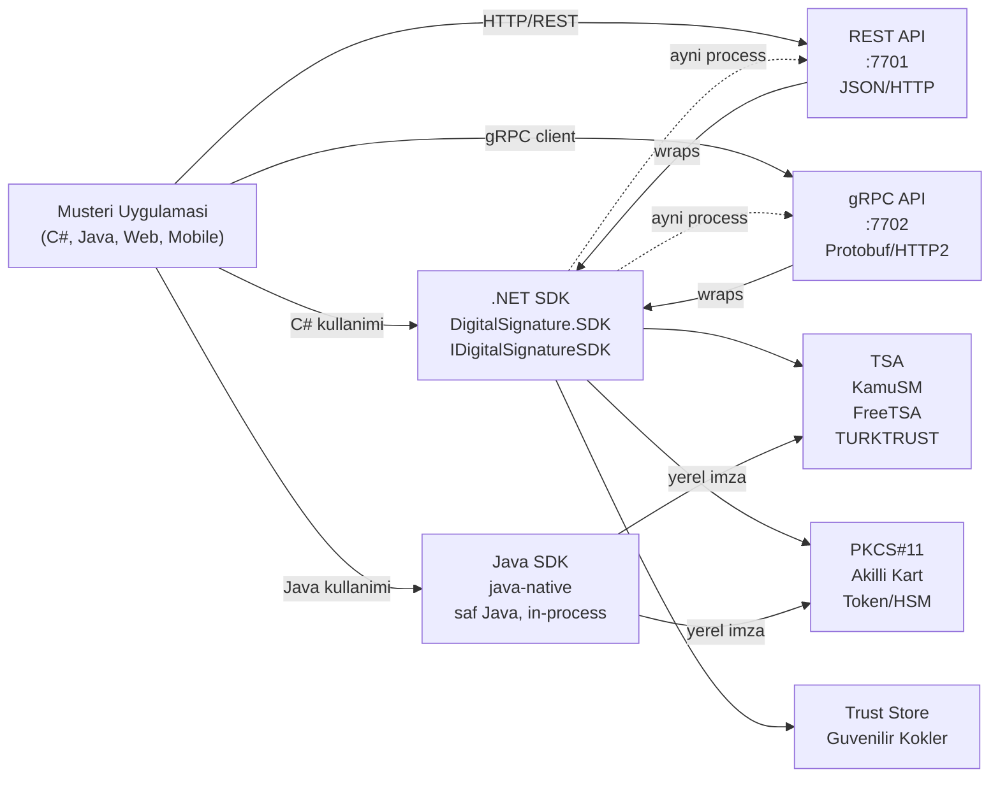
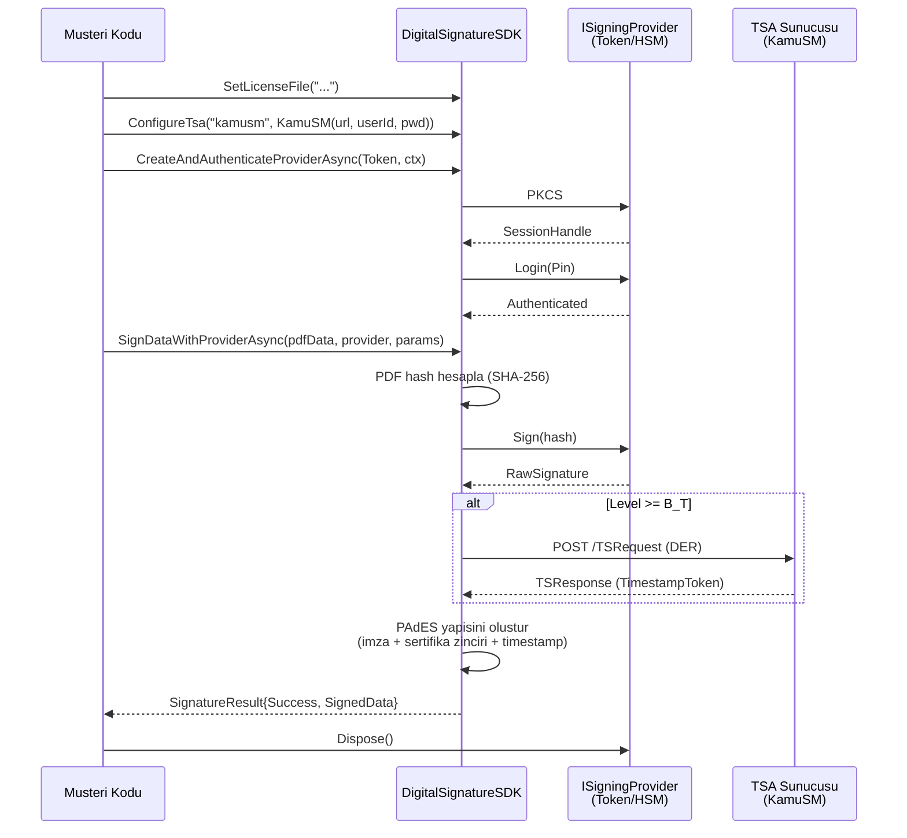
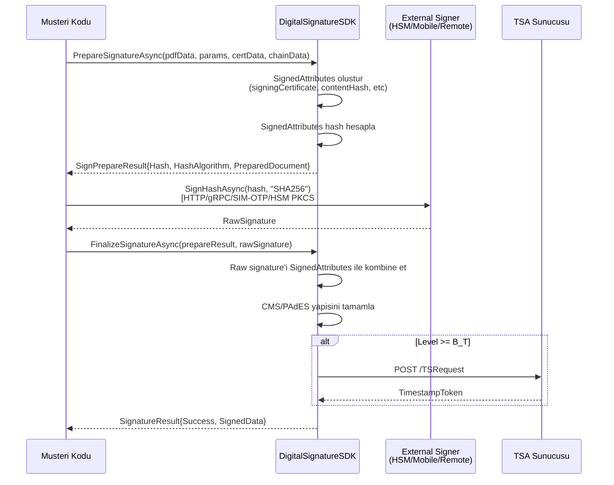
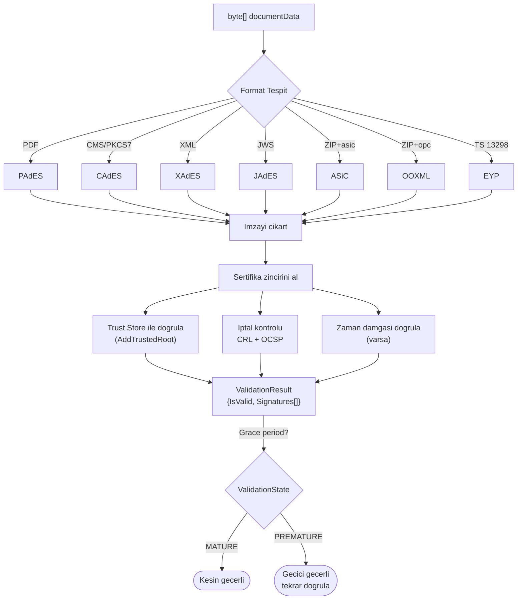
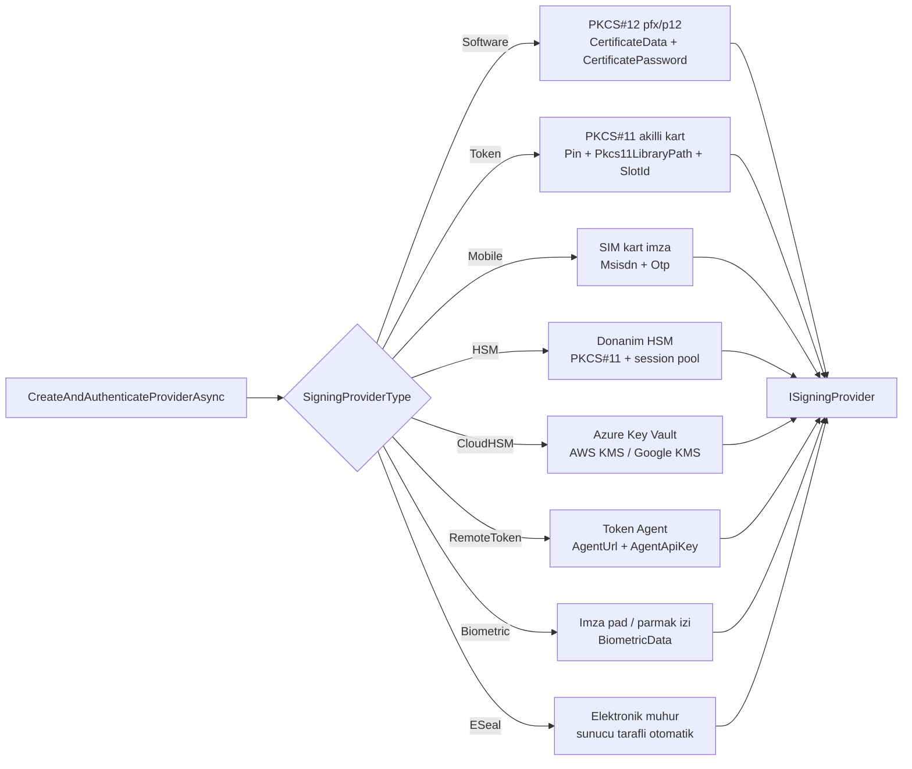
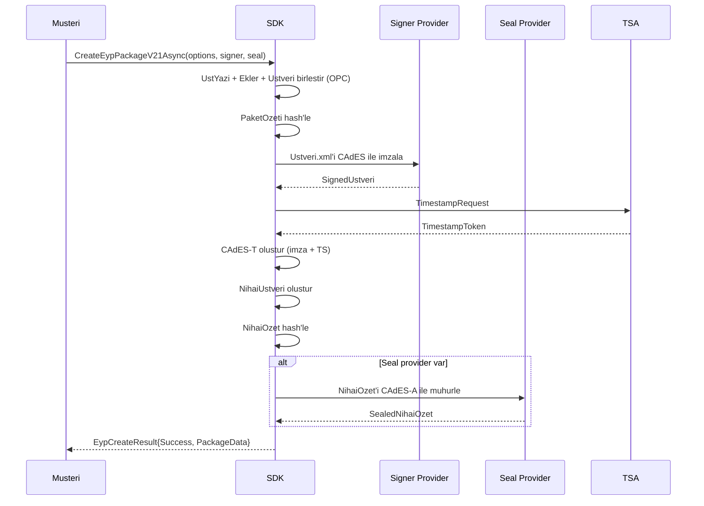
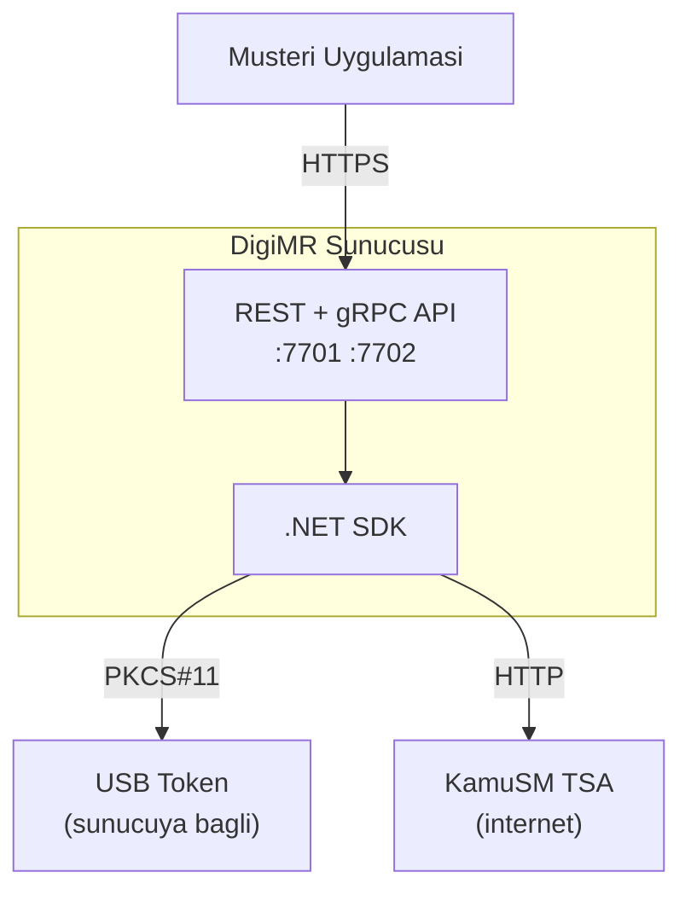
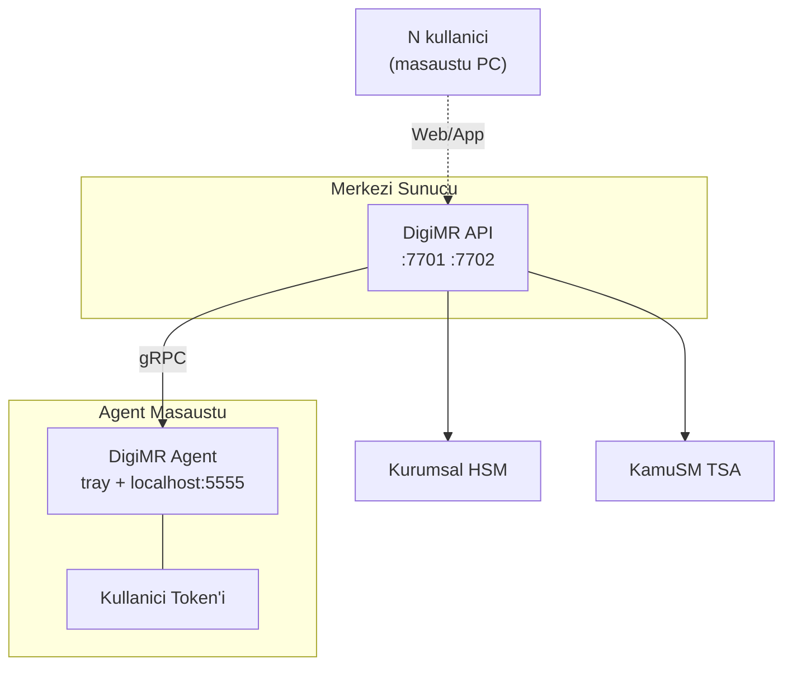

# DigiMR Mimari

**SDK Versiyon:** 2.0 | **Son Guncelleme:** 2026-04-17

Bu dokuman DigiMR sisteminin ust seviye mimari gorunumunu, katmanlar arasi iletisimi ve tipik veri akislarini diyagramlarla anlatir.

---

## 1. 4 Katmanli Yapi

**Katmanlar:**

| Katman | Sorumluluk | Port/Kapsam |
|---|---|---|
| **Client** | Kullanici uygulamasi (EBYS, e-ticaret, mobile app) | N/A |
| **.NET SDK** | Ana kutuphane, imzalama + dogrulama mantigi | NuGet `DigitalSignature.SDK` |
| **REST API** | HTTP/JSON API — SDK'nin uzaktan erisim arayuzu | `:7701` |
| **gRPC API** | Binary protokol — yuksek performans + streaming | `:7702` |
| **Java SDK** | Saf Java in-process imzalama kutuphanesi (CAdES/PAdES/XAdES/JAdES/EYP, BouncyCastle/PDFBox) — eski gRPC/MA3 istemcisi emekliye ayrildi, release hazirlaniyor | JAR, kurumsal Java uygulamalari |

---

## 2. Tipik Imzalama Akisi (PAdES B-T)

**Onemli noktalar:**
- `using var provider` — provider `IDisposable`, mutlaka dispose edilmeli (token session'i kapar)
- B-B seviyesinde TSA cagrilmaz, B-T ve ustunde cagrilir
- Hash algoritmasi `SignatureParameters.HashAlgorithm` ile kontrol edilir (varsayilan SHA-256)

---

## 3. Iki Asamali Imza (Prepare/Finalize)

External signer (uzak HSM, mobil imza, merkezi imza servisi) kullanildiginda.

**Kullanim alanlari:**
- **HSM:** Private key HSM'den ayrilmaz; SDK sadece hash'i imzalatir
- **Mobil imza:** Kullanici telefonunda OTP + SIM kart imzasi
- **Merkezi imza servisi:** Regulasyon geregi imza operasyonu ayri serviste

Detay: [ORNEKLER.md Senaryo 14](ORNEKLER.md#senaryo-14-iki-asamali-imza-preparefinalize--external-signer)

---

## 4. Dogrulama Akisi

**Grace Period mantigi (`ValidationOptions.GracePeriodSeconds`):**
- 0 = grace period kullanilmaz, iptal anlik kontrol edilir
- \>0 = Imzalama zamanindan sonraki N saniye icinde iptal bildirimi olsa bile imza gecerli sayilir (ETSI EN 319 102-1 §5.6.2.3)

---

## 5. Provider Tipleri ve Yetkilendirme

Detay: [SAGLAYICILAR.md](SAGLAYICILAR.md)

---

## 6. EYP Olusturma Akisi (TS 13298 V2.0)

**Hukuki zemin:** TS 13298 V2.0 — Elektronik Yazisma Paketi standardi. Ustyazi ve muhur iki ayri islem; regulasyon imzacinin gercek kisi, muhurun kurum olmasini gerektirir.

---

## 7. Dağıtım Topolojileri

### 7.1 Tek Sunucu (Basit Deployment)

### 7.2 Cok Makineli (Enterprise)

- **Agent:** Kullanicinin kendi token'i ile uzaktan imzalama (`QueryRemoteTokensAsync`, `RemoteToken` provider)
- **Merkezi HSM:** Kurumsal muhur/e-seal sertifikasi

---

## 8. Veri Akisi — Performans Notlari

- **Senkron imza:** PDF ~1 MB, Token: ~500ms (PIN login dahil: ilk kez ~2s)
- **Batch imza:** Tek authentication ile 50 PDF x 50ms ~= 2.5s (token session reuse)
- **HSM + session pool:** Paralel 8 worker ile 1000 PDF ~= 15s
- **gRPC vs REST:** Buyuk belgeler (>5MB) icin gRPC %30-50 daha hizli (binary format)
- **Validation:** 1 MB PDF, 1 imza ~= 200ms; CRL/OCSP online kontrol varsa +500-1000ms

Olcum: `tests/DigitalSignature.Tests/PerformanceBenchmarkTests.cs` (urun deposu), `dotnet test --filter FullyQualifiedName~PerformanceBenchmarkTests`

---

## 9. Ilgili Dokumantasyon

- [GENEL_BAKIS.md](GENEL_BAKIS.md) — Hizli navigasyon + giris
- [SDK_REFERANS.md](SDK_REFERANS.md) — SDK tam API referansi
- [API_REFERANS.md](API_REFERANS.md) — REST API tam referansi
- [CHANGELOG.md](CHANGELOG.md) — Surum gecmisi + migration
- [SAGLAYICILAR.md](SAGLAYICILAR.md) — 8 saglayici tipi detayi
